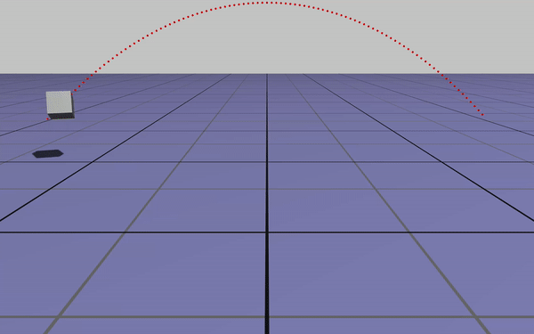
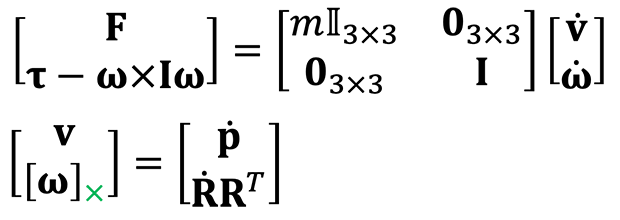
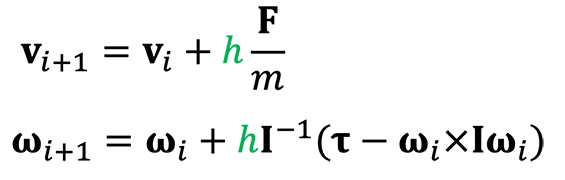
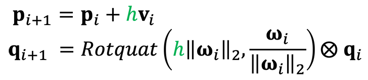
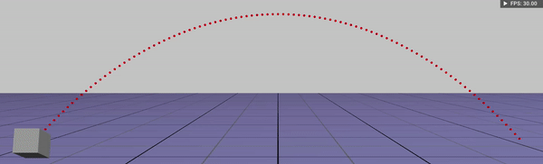
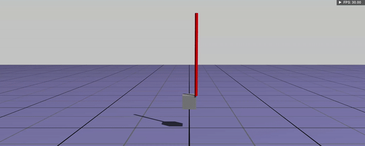

# Assignment 5 - Rigid bodies 

**Hand-in:** May 14, 2021, 18:00 CEST 

In this assignment, we will make a rigid body simulator somewhat like this.


*Figure 1: rigid body simulations. Videos from [MobyMotion](https://www.youtube.com/c/MobyMotion), [NVIDIA](https://youtu.be/1o0Nuq71gI4).*

Okay, to be honest, it's actually more like this.



*Figure 2: the rigid body simulator that we will create.*

Does it look boring? Believe me, what they do are fundamentally same. 

## Hand-in

Once you complete this assignment you should hand in
- a short video demonstrating your baseline (Ex.1 ~ Ex.3) implementation. (**filename: demo1.mp4**)
- a short video demonstrating Ex.4 implementation. (**filename: demo2.mp4**)
- code pushed to your github repository. 
    
The grading scheme is as follows
- baseline (80 %): based on your code, your answer in README (Ex.1) and a demo video. 
- advanced (20 %): based on your code and a demo video. 

Please leave your questions on GitHub, so your colleagues also can join our discussions. 

## Exercises

Okay now let's do this step-by-step :) Please note, from now on, we will assume every rigid body object has a same mass and a same dimension (for simplicity. Of course it's pretty straight-forward to extend this for more general cases).

### Ex.1 Numerical Integration (baseline - 40%)

What is a rigid body simulator? What does it do? In fact, it's nothing but a solver that find a solution of the following equations:



where **v**, **w**, **p**, **R** are linear velocity of center of mass of a rigidbody, angular velocity, position and orientation (3x3 rotational matrix) respectively (they are all expressed in world frame). The mass and moment of inertia (expressed in world frame) of the rigid body is *m* and **I**. We want to find **v**, **w**, **p**, **R** at time *t*, given profile of external force **F** and torque **t**. 

If we use an unit quaternion for orientation instead of a rotational matrix and discretize these equation, we get: 





where *h* is a timestep of the simulation. Note that here we use explicit (forward) Euler method.

Your very first task is implementing this numerical integration step in ```src/libs/sim/include/sim/RBPhysicsEngine.h```. Again, here we are going to use explicit (forward) Euler method. For now, just assume that only gravity is a source of external force. Once you complete the implementation, run ```rigidbodies``` app, and select **Projectile** in simulation scene menu and play (or just tap **SPACE**). You should see something like this: 



*Figure 3: the rigid body simulation that we will create.*

Okay, if your projectile simulation works properly, change the simulation rate and notice how the trajectory of the rigidbody changes. What do you notice and why it happens? **Leave your answer in a single sentence below. A correct answer will be counted as 10%.**

```diff
+ What do you notice?
- The simulated curve (green) goes closer and closer to the analytical curve (red) when the simulation rate increases
+ Why it happens?
- Because in implementation, we suppose the linear and angular velocity to be constant during each time step [t,t+dt).
```

### Ex.2 Springs (baseline - 20%)

Okay, now let's add some external force sources: we will create springs in the simulation scenes. 

Your task is implementing your logic for spring forces that are applied from 
- Ex.2-1 (10%): a spring fixed to the world: one end of spring is attached to a rigidbody while another end is attached to some fixed point. 
- Ex.2-2 (10%): a spring which of both ends are attatched to rigid bodies.  

Every spring has a same spring constant, and its force is linear to displacement i.e. f = -k(x-x<sub>0</sub>). Once you finish your implementation, run ```rigidbodies``` app, and select **Fixed Springs** or **Rigid Body Springs** in simulation scene menu. Once you play the simulation... oh wait something bad thing is happening!



*Figure 4: The simulation is blown up!*

### Ex.3 Stable Simulation (baseline - 20%)

Well, in fact, this is super normal. I hope you already figured out what the problem is. If not... I will give you a hint. Did you notice that the trajectory of the projectile object (in **Projectile** scene) differs from the analytical trajectory (red)? Why it's the case?  

Okay, if you know why, then it's pretty clear what we need to do for making our rigid body simulator more stable. Your task is making our simulator stable enough so that we can simulate springs with *dt = 1/30* (simulation rate, 30Hz). **Record a demo video ~ 30 secs that shows all three simulation scenes and upload it to this repository with a name "demo1.mp4".** Do a double check if your video can be played without any additional encoding/decoding. It's also fine to upload your video to YouTube and add its link to on the top of this README.md. If I cannot play or access your video until the deadline, you won't get full points. 

Once you are done, again try to change the timestep *dt* and see what happens (this question is not for points, and you are free to discuss with your colleagues). 

### Ex.4 Impulse-based Collisions (advanced - 20%)

Well, it looks good already, but you may not be very happy from the fact that the rigid body objects go through the ground (or each other). Well, we can give a slightly more effort to simulate collisions between objects. For simplicity, let's simulate collisions between (rigid bodies~ground) only. So we will neglect collisions between (rigid body~rigid body). 

Read the material, [ImpulseBasedCollisions](http://crl.ethz.ch/teaching/computational-motion-21/slides/ImpulseBasedCollisions.pdf) from our course website, see the comments in ```src/libs/sim/include/sim/RBPhysicsEngine.h```, and implement impulse-based collision simulation logic for **frictional and restitutional** contact.

**Record a demo video ~ 30 secs that shows all three simulation scenes and upload it to this repository with a name "demo2.mp4".** In the video, please show that your simulation works with different coefficient of friction (mu) and coefficient of restitution (epsilon). Do a double check if your video can be played without any additional encoding/decoding. It's also fine to upload your video to YouTube and add its link to on the top of this README.md. If I cannot play or access your video until the deadline, you won't get full points. 

